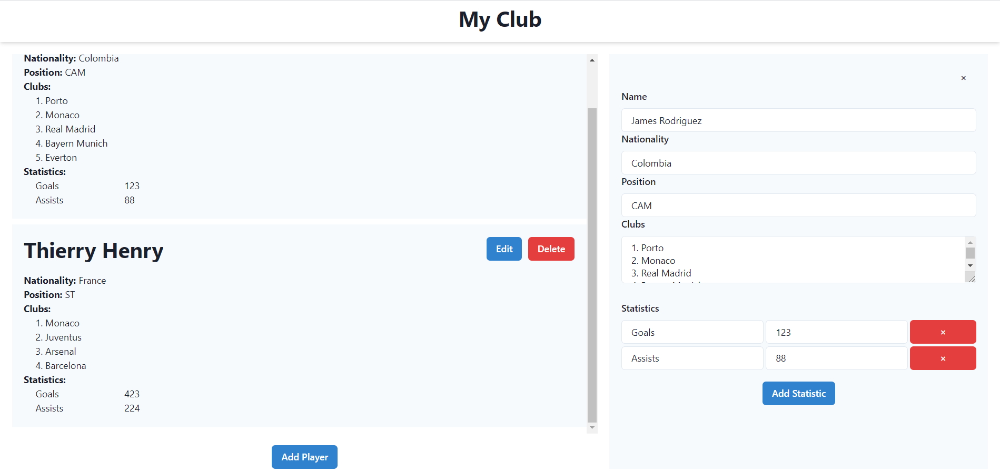

# My Club

> Create your club with favorite players and their statistics

Simple project built after watching Web Dev Simplified's course. Includes kind of to do list with ability to add players and their statistics.

_Live demo: [my-club-react.netlify.app](https://my-club-react.netlify.app/)_



## Installation

OS X & Linux & Windows:

```sh
npm install
```

## Usage

Main idea was to create a simple boilerplate that can be used in future projects.

## Release History

- 0.0.1
  - Simple functionality, user can add, edit and remove players.

## Contributing

1. Fork it (<https://github.com/jorgadev/my-club/fork>)
2. Create your feature branch (`git checkout -b feature/fooBar`)
3. Commit your changes (`git commit -am 'Add some fooBar'`)
4. Push to the branch (`git push origin feature/fooBar`)
5. Create a new Pull Request
